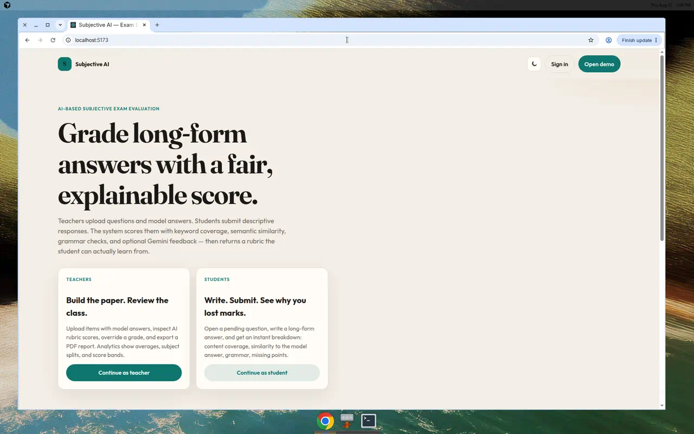
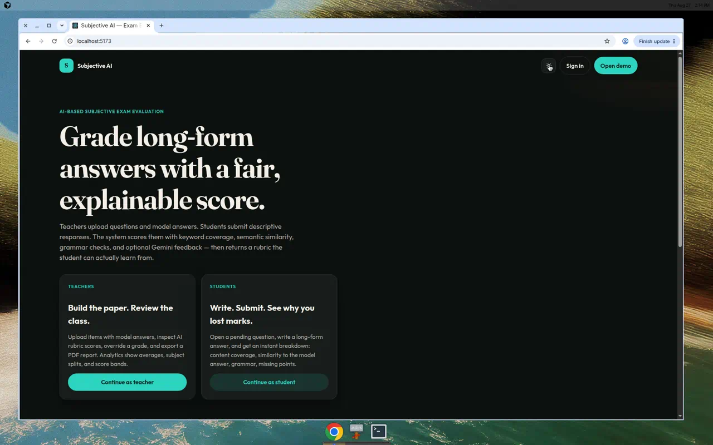
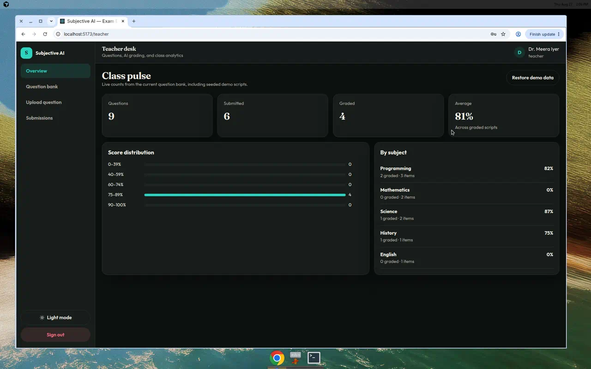
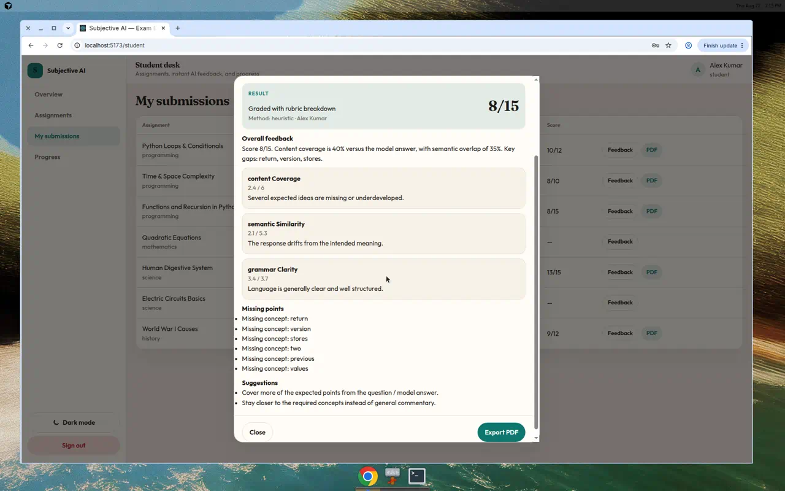

# AI-Based Subjective Exam Evaluation System

Teachers upload questions **and model answers**. Students submit long-form responses. The app scores them with NLP (keyword coverage, semantic overlap, grammar/clarity) and optional **Gemini**, then shows a rubric — not a single unexplained number.

This is a placement-ready rewrite of the original project: modern dark/light UI, demo seed data so the dashboards look alive, teacher analytics, PDF export, and a documented deploy path.

## Product

| Role | What you can do |
| --- | --- |
| **Teacher** | Author questions with model answers, inspect the class pulse (averages, subject split, score bands), re-run AI grading, override by editing, export a PDF report |
| **Student** | Open pending work, submit a descriptive answer, receive instant rubric feedback (content / similarity / language, missing points, suggestions), export the report |

Evaluation always works **without** a Gemini key (local heuristic). When `GOOGLE_API_KEY` is set, the API prefers Gemini and falls back to the heuristic if the model call fails.

## Demo accounts

| Role | Email | Password |
| --- | --- | --- |
| Teacher | `teacher@demo.local` | `demo123` |
| Student | `student@demo.local` | `demo123` |

These are sample credentials for the portfolio demo, not production secrets.

Without MongoDB, the API boots an **in-memory store** preloaded with graded, submitted, and pending scripts. Use **Restore demo data** on the teacher overview if you want a clean seed again.

## Local run

You need Node.js 18+.

**1. API**

```bash
cd backend
cp .env.example .env
# leave MONGO_URI and GOOGLE_API_KEY empty for the fastest demo
npm install
npm start
```

API: [http://localhost:5038](http://localhost:5038) · health: [http://localhost:5038/health](http://localhost:5038/health)

**2. Web app** (second terminal)

```bash
cd frontend
cp .env.example .env
# VITE_API_URL=http://localhost:5038
npm install
npm run dev
```

App: [http://localhost:5173](http://localhost:5173)

Sign in as teacher or student and click through Overview → Assignments → a graded script. Dark/light toggle lives in the landing header and the dashboard sidebar.

### Optional services

| Variable | Where | What happens if omitted |
| --- | --- | --- |
| `MONGO_URI` | backend | In-memory demo store (resets when the process stops) |
| `GOOGLE_API_KEY` | backend | Heuristic NLP grading only |
| `FRONTEND_ORIGIN` | backend | Defaults to allowing all origins (`*`) |
| `AUTH_SECRET` | backend | Dev default is used to sign demo tokens — change it in production |
| `VITE_API_URL` | frontend (build-time) | Defaults to `http://localhost:5038` |

Never commit `.env` files. Placeholders live in `backend/.env.example` and `frontend/.env.example`.

## Deploy (recruiter path)

Split deploy is the reliable option: **frontend on Vercel**, **API on Render** (or Railway).

### A. API on Render

1. Push this repo to GitHub.
2. [Render](https://render.com) → New → Blueprint, or New Web Service with:
   - Root directory: `backend`
   - Build: `npm install`
   - Start: `npm start`
   - Health check: `/health`
3. Set environment variables (no values are committed):

```
PORT=5038
FRONTEND_ORIGIN=https://YOUR-FRONTEND.vercel.app
MONGO_URI=                 # optional Atlas URI
DB_NAME=examdb
GOOGLE_API_KEY=            # optional Gemini key
GEMINI_MODEL=gemini-2.0-flash
AUTH_SECRET=               # long random string
```

A `render.yaml` Blueprint is in the repo root. `backend/Procfile` also works on Railway (`Root Directory: backend`).

If `MONGO_URI` is empty, Render still serves the seeded in-memory demo (data is per-instance and ephemeral). For a persistent demo, add a free MongoDB Atlas cluster and paste the URI.

### B. Frontend on Vercel

1. [Vercel](https://vercel.com) → Import the GitHub repo.
2. Framework: Vite.
3. Root directory: `frontend`.
4. Build command: `npm run build`
5. Output directory: `dist`
6. Environment variable (required for production):

```
VITE_API_URL=https://YOUR-API.onrender.com
```

`vercel.json` rewrites all routes to `index.html` so React Router works on refresh.

After deploy, open the Vercel URL, sign in with a demo account, and confirm the landing page health line can reach the API.

### One-box alternative

You can reverse-proxy the API yourself or attach a static `frontend/dist` to any Node host. The important contract is: the browser calls `VITE_API_URL`, and the API allows that origin in `FRONTEND_ORIGIN`.

## UI tour

Landing (light and dark), teacher analytics, and a student rubric after submit:






- **Landing** — editorial hero, teacher/student desks, how-it-works, API health (store mode + whether Gemini is configured). Theme toggle in the nav.
- **Sign in** — demo account chips fill the form. Role-gated dashboards.
- **Teacher** — class pulse analytics, question bank with model answers, upload form, submissions table, **AI grade**, **PDF** export, restore seed.
- **Student** — stats, assignment cards, submit modal, rubric (content / similarity / grammar, missing points), progress by subject, PDF export.
- **Empty / loading / error** — skeleton, retry, and empty states instead of blank screens.

## Stack

- **Frontend:** React 19, Vite, React Router, CSS design tokens (no Bootstrap).
- **Backend:** Node.js, Express, optional MongoDB, optional Gemini (`@google/generative-ai`).
- **Scoring:** heuristic NLP always; Gemini JSON rubric when a key is present.

## Project layout

```
backend/            Express API
  lib/evaluate.js  Gemini + heuristic grader
  lib/seed.js      Demo question bank
  lib/store.js     Memory or Mongo adapter
  lib/auth.js      Demo login tokens
frontend/           Vite + React app
render.yaml         Render Blueprint for the API
vercel.json         SPA fallback
```

## Notes vs the original README

The original app described NLP + dashboards but the Gemini client was unused, model answers were not stored, secrets were hardcoded, and the UI was a light-only dashboard with broken logout. This version keeps the same product (subjective exam evaluation) and actually implements those pieces.
